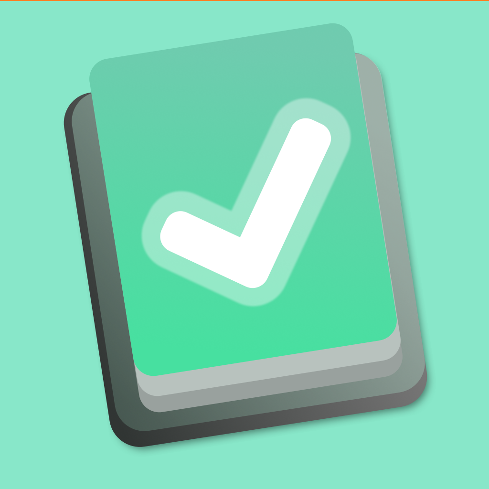
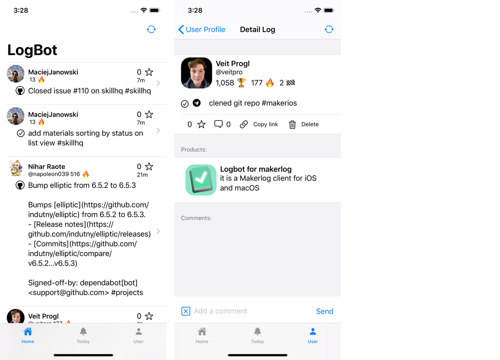
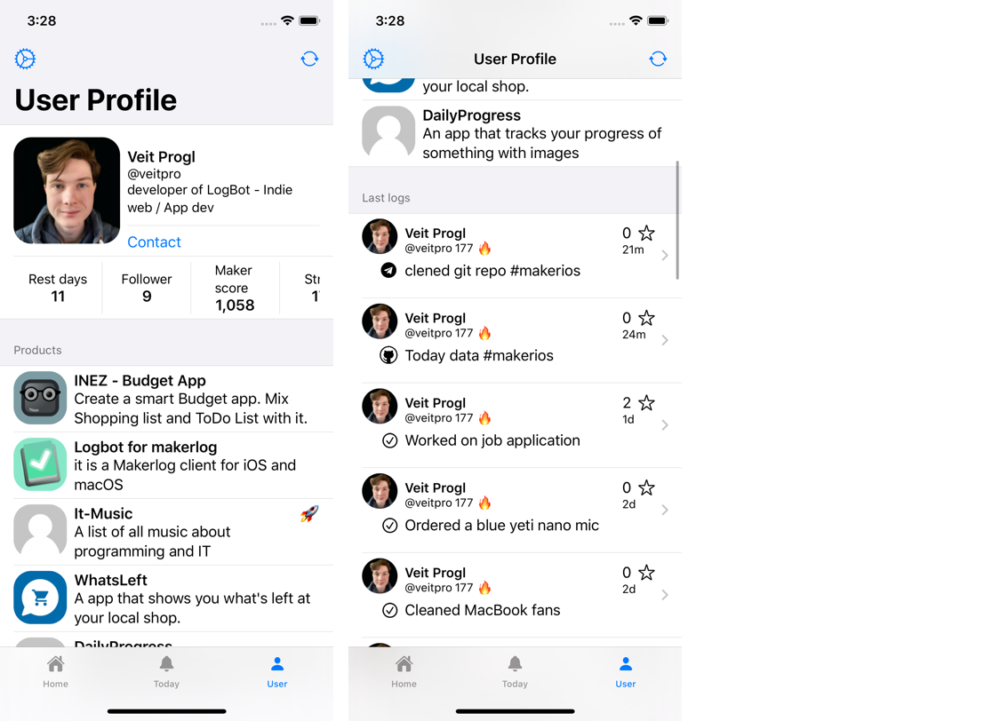
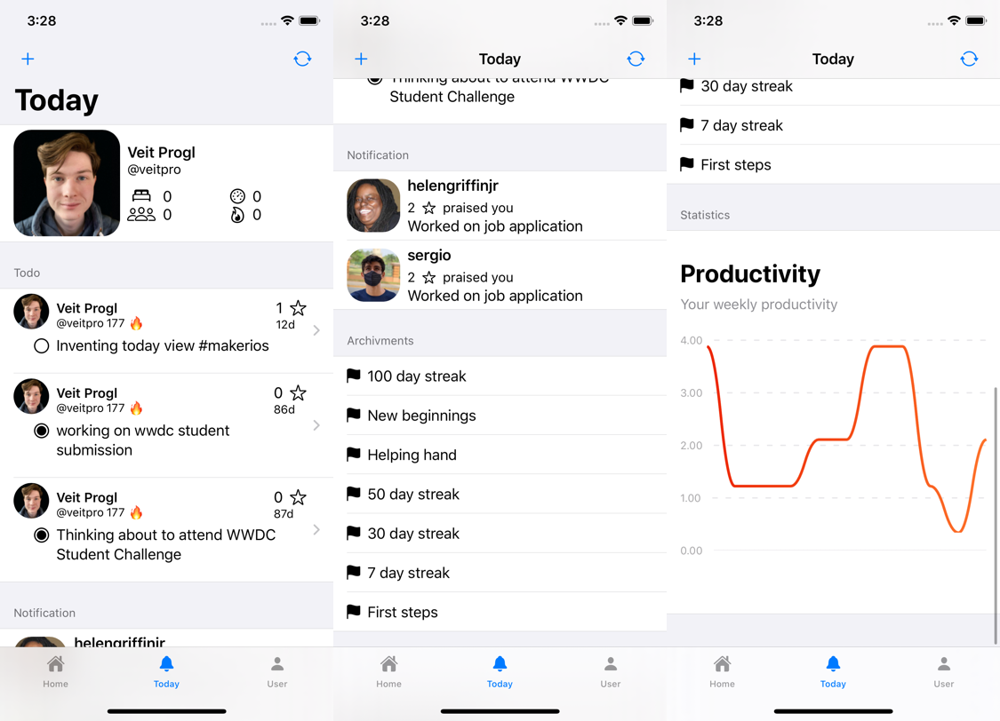

<h2>LogBot a makerlog client
  
</h2>

Logbot is the only native [makerlog](https://getmakerlog.com/log) client. It is build for iOS 13 and above. 

This client allowys you to use makerlog wihout the need of a webbrowser. The current build of this client allowys you to:

- Log new tasks 
- add comments to tasks
- like / praise a task
- see user stats 
- see your tasks for today 
- see your Archivments
- look at your recened tasks 
- browse the tasks feed (log feed)
- Darkmode

## Download

Logbot is on Tastflight! [Download via Testflight](https://testflight.apple.com/join/VjqcghvC)

## Screenshots

